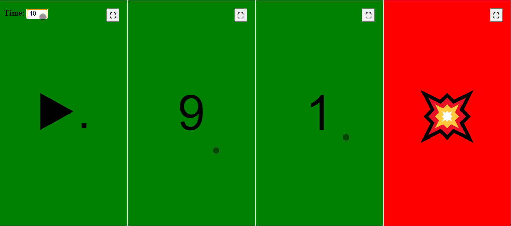

# Simple Game Turn Timer
A simple JavaScript game turn timer you can use on your phone. Aims to punish the player who takes too much time for their turn.

It can be used at:
https://erhanalankus.github.io/simple-game-turn-timer/

Set the time and click anywhere on the screen. Any click will reset the timer. The screen will turn red when the time runs out.

